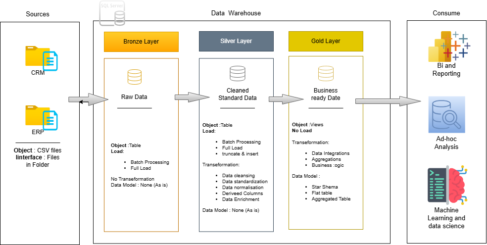

# Modern SQL Data Warehouse & Analytics Platform

This repository showcases a comprehensive, end-to-end SQL-based data warehousing solution.
My object with this project was building a robust platform capable of consolidating disparate data sources, ensuring data quality, and providing an optimize foundation for advance analytics and business intelligence.
This project reflects my practical skill of data architecure, data engineering, and data moedling.

# Simple SQL Data Warehouse Project

This repository contains a basic SQL-based data warehouse project. It demonstrates how to take raw data, clean it, transform it, and load it into a structured format for easy analysis.

## Table of Contents

- [About This Project](#about-this-project)
- [Data Architecture](#data-architecture)
- [How It Works](#how-it-works)
- [Technologies Used](#technologies-used)
- [Getting Started](#getting-started)
  - [Prerequisites](#prerequisites)
  - [Setup](#setup)
  - [Run the Data Load](#run-the-data-load)
- [Project Structure](#project-structure)
- [Contact](#contact)

## About This Project

This project simulates a simple data warehouse. My goal was to create a clear example of:
* **Data Ingestion:** Getting raw data into a database.
* **Data Cleaning:** Making data consistent and fixing common issues.
* **Data Transformation:** Organizing data into a format suitable for reporting.
* **Analytical Ready Data:** Creating tables that are easy to query for insights.

It's a foundational project to understand how data moves from its raw state to a usable analytical database.

## Data Architecture
The data architecture for this project follows Medallion Architecture **Bronze**, **Silver**, and **Gold** layers:


## How It Works

1.  **Bronze Layer:** Stores raw data exactly as it comes in.
2.  **Silver Layer:** Holds cleaned and standardized data.
3.  **Gold Layer:** Contains final, organized data ready for analysis (e.g., for reports).

SQL scripts manage all steps of moving and transforming data between these layers.

## Technologies Used

* **Database:** SQL Server
* **Language:** SQL (T-SQL)
* **Tools:** SQL Server Management Studio (SSMS)
* **Version Control:** Git, GitHub

## Getting Started

Follow these steps to run the project on your machine.

### Prerequisites

* **SQL Server (Developer Edition):** [Download Link](https://www.microsoft.com/en-us/sql-server/sql-server-downloads)
* **SQL Server Management Studio (SSMS):** [Download Link](https://docs.microsoft.com/en-us/sql/ssms/download-sql-server-management-studio-ssms)
* **Git:** [Download Link](https://git-scm.com/downloads)

### Setup

1.  **Clone this repository:**
    ```bash
    git clone [https://github.com/your-username/simple-sql-data-warehouse.git](https://github.com/your-username/simple-sql-data-warehouse.git)
    cd simple-sql-data-warehouse
    ```
2.  **Create Database:**
    * Open `Scripts/init_database.sql` in SSMS and run it. This creates your database (e.g., `Datawarehouse`).
3.  **Create Tables:**
    * Run the below script to craete tables :
      `Scripts/bronze/ddl_bronze.sql` for bronze layer, `Scripts/silver/ddl_silver.sql` for silver layer.
      Gold layer is final layer so directly create and load views in gold layer in further steps.

### Run the Data Load

The data processing happens through SQL scripts in order:

1.  **Raw Data:** Please check the Data sets into a`datestes` directory.
2.  **Datasets:** Dowload the data and put into the `datestes` (you can rename it) and check the nested folders for data
    such as Source CRM contains `datestes/source CRM/cust_info.csv`, `datestes/source CRM/prd_info.csv`, and
    `datestes/source CRM/sales_details.csv` 
4.  **Load Bronze Layer:** Run scripts from `Scripts/bronze/proc_load_bronze.sql` to load raw data.
5.  **Transform to Silver Layer:** Run scripts from `Scripts/silver/proc_load_silver.sql` to clean data.
6.  **Build Gold Layer:** Run scripts from `Scripts/gold/ddl_gold.sql` to create final analytical tables(views).
7.  **Verify:** Check the tables in the `Gold layer` schema in SSMS to see the results.

## Project Structure
```
data-warehouse-project/
│
├── datasets/                           # Raw datasets used for the project (ERP and CRM data)
│
├── docs/                                # Project documentation and architecture details
│   ├── data_architecture                # image file shows the project's architecture
│   ├── data_flow                        # image file for the data flow diagram
│   ├── data_models                      # image file for data models (star schema)
|   ├── data_integration                 # image file for the data intgration model
│
├── scripts/                            # SQL scripts for ETL and transformations
│   ├── bronze/                         # Scripts for extracting and loading raw data
│   ├── silver/                         # Scripts for cleaning and transforming data
│   ├── gold/                           # Scripts for creating analytical models
│
├── tests/                              # Test scripts and quality files
│
├── README.md                           # Project overview and instructions
├── LICENSE                             # License information for the repository
├── .gitignore                          # Files and directories to be ignored by Git
└── requirements.txt                    # Dependencies and requirements for the project
```
---
## Contact

Feel free to connect:

* **Subhan Sayyed:** [[LinkedIn](https://www.linkedin.com/in/subhan-sayyed-559374137 )]
* **GitHub:** [[GitHub](https://github.com/subhaansd5)]
